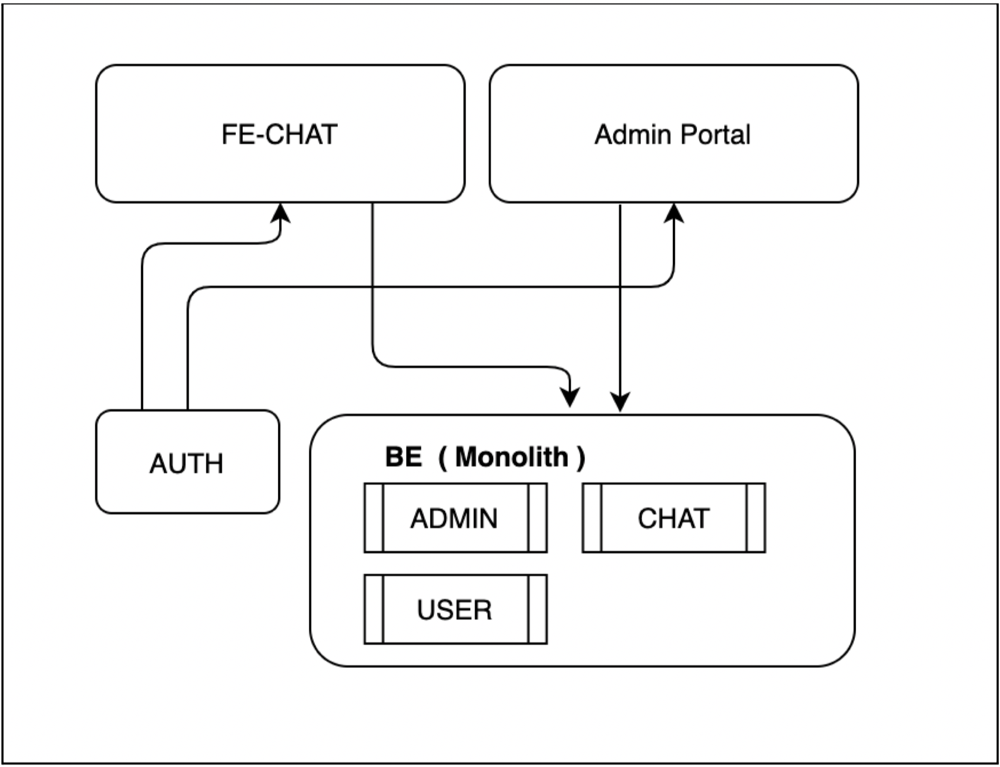

# Push-to-talk backend mock



**Warning:** This project cannot be run. It is used to serve as a general idea of how the backend will look like.



<!-- 
This project cannot be run. It is used to serve as a general idea of how the backend will look like.
 -->

This project was created as part of the **Junior/Associate Software Engineer Challenge** at [Fastwork](https://fastwork.co). 

## Requirements

We want to enable “Push-to-Talk” features on our chat-platform. This is the business requirement:

- Only users that are in the whitelist can use this feature
- Each user can only record max to 1minutes
- Files will be kept as base64 content in DB
- Only users in chat & FastworkAdmin can listen to the recording
- FastworkAdmin can see a report of recording of each chat with detail 
    - ChatRoomName
    - Sender
    - Recording length
- Forecast record peak hours will reach 20 TPS.

### Given 

- Frontend recording is already done and ready to integrate to the backend as per your design
- Current high-level tables in database:
    - Users
        - ID <PK> - auto-generated ID for user.
        - Full name - The full name for this user.

    - Admin
        - ID <PK> - auto-generated ID for Admin.
        - Username - Admin name
    - ChatRoom
        - ID <PK> - auto-generated ID for chat
        - Name - The name of this order
        - SellerID - The user who offer their service.
        - BuyerID - The user who created this chat.
- Assuming all services already have API for CRUD exposed.
- High level of current architecture
    

## The overview of service/components

## Table design 