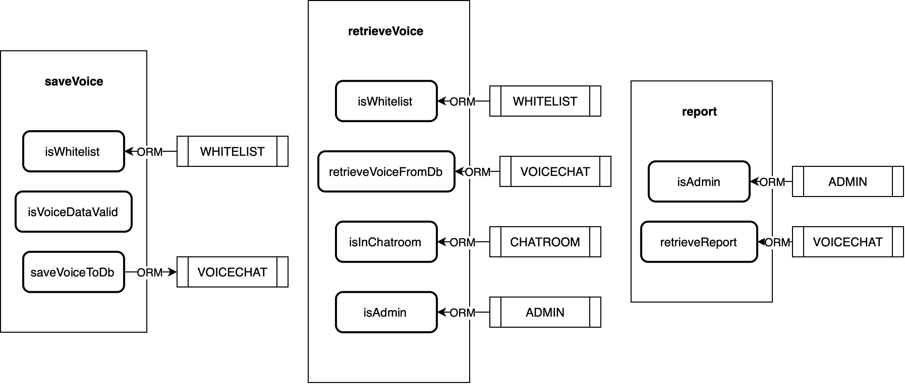
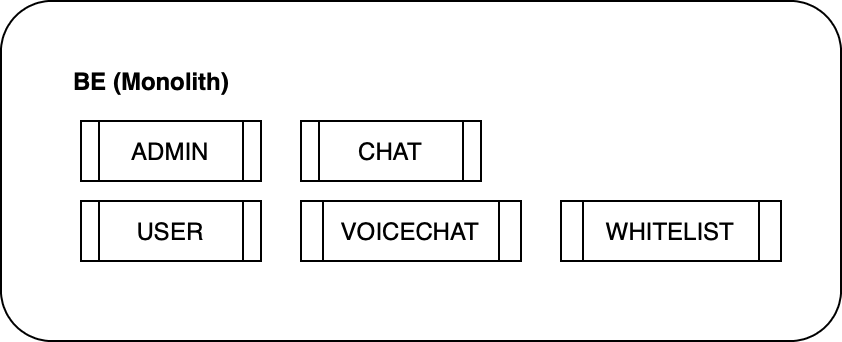
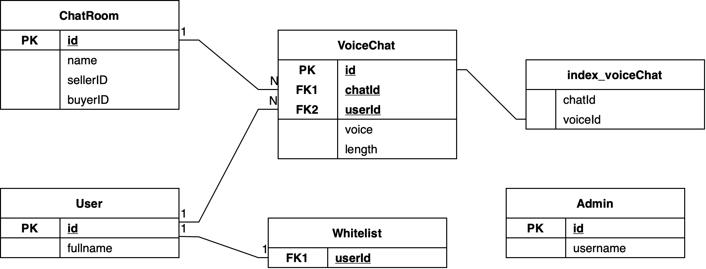

# Push-to-talk backend mock

<blockquote style="background: #FDFAF1; border-left: 5px solid #F9A75D; padding: 10px; color: #2B2B2B">
<h6 style="color:#2B2B2B">⚠️ Warning</h6>

This project cannot be run. It is used to serve as a general idea of how the backend will look like.

</blockquote>

This project was created as part of the **Junior/Associate Software Engineer Challenge** at [Fastwork](https://fastwork.co).

---
## Requirements

We want to enable “Push-to-Talk” features on our chat-platform. This is the business requirement:

- Only users that are in the whitelist can use this feature
- Each user can only record max to 1minutes
- Files will be kept as base64 content in DB
- Only users in chat & FastworkAdmin can listen to the recording
- FastworkAdmin can see a report of recording of each chat with detail
  - ChatRoomName
  - Sender
  - Recording length
- Forecast record peak hours will reach 20 TPS.

### Given

- Frontend recording is already done and ready to integrate to the backend as per your design
- Current high-level tables in database:

  - Users

    - ID <PK> - auto-generated ID for user.
    - Full name - The full name for this user.

  - Admin
    - ID <PK> - auto-generated ID for Admin.
    - Username - Admin name
  - ChatRoom
    - ID <PK> - auto-generated ID for chat
    - Name - The name of this order
    - SellerID - The user who offer their service.
    - BuyerID - The user who created this chat.

- Assuming all services already have API for CRUD exposed.
- High level of current architecture
  

---
## The overview of service/components

There are 3 main modules in this project. Inside each modules, there are smaller modules which can be listed as
- push-to-talk
    - report - return a report for admin on voice chat
    - retrieve-voice - retrieve voice chat from database
    - save-voice - save voice chat to database
- chatroom
    - is-in-chatroom - check if a given user is in a given chat room
- user
    - validations - provide various modules to validate user information; such as is-admin (validate if given user is admin)

Below is the illustration of `push-to-talk` modules and how they interact/use other modules.

## Table design
There are 2 added tables; VoiceChat and Whitelist.

Below is a diagram to show the relationships and metadata for each table in the database. 

---
## Note

- In order to interact with database, an ORM tool will be used. Although, no ORM tool was specified in project, the coding style is referenced from [prisma.io](https://www.prisma.io).
- Since voice is stored as base64 format, it is possible to send voice data in the request body. However, for better practice, it should be sent as a multipart form. (Using BLOB would be more efficient to store in the database as well.)
